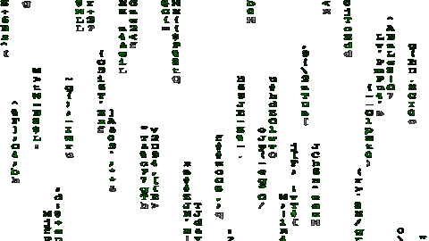

<!--  -->

<h1 align="center">👋🏻 Hi! I am AnderCMD</h1>
<h3 align="center">I am a software engineer with 2+ years of experience 💻</h3>

 

  
  
  
  
  
  
  
  
  

 

<h2 align="left">Technologies 💻</h2>

###

###

  

    <h3>Frontend 🖥️</h3>
    
    
    
    
    
    
    
  

  

    <h3>Backend 🧠</h3>
    
    
    
    
  

  

    <h3>Languages 📖</h3>
    
    
    
    
    
  

  

    <h3>Databases 📊</h3>
    
    
    
  

  

    <h3>Services ☁️</h3>
    
    
    
  

  

    <h3>Graphic Design ✏️</h3>
    
    
    
  

###

 

<h2 align="left">Statistics🏅</h2>

###

  
  

###

###
